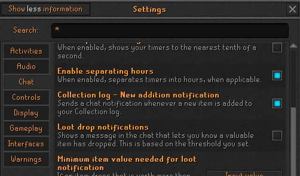

# Dink

Dink sends webhook messages upon noteworthy in-game events.
While Dink supports the Discord webhook format (with rich embeds and optional screenshots), it also includes additional metadata that allows custom webhook servers to analyze messages or even generate their own messages.
This project was forked from UniversalDiscordNotifier, but has more features, reliability, configurability, testing, and maintainer activity. 

## Notifiers

- [Death](#death): Send a webhook message upon dying (with special configuration for PK deaths)
- [Collection](#collection): Send a webhook message upon adding an item to your collection log
- [Level](#level): Send a webhook message upon leveling up a skill (with support for virtual levels)
- [Loot](#loot): Send a webhook message upon receiving valuable loot
- [Slayer](#slayer): Send a webhook message upon completing a slayer task (with a customizable point threshold)
- [Quests](#quests): Send a webhook message upon completing a quest
- [Clue Scrolls](#clue-scrolls): Send a webhook message upon solving a clue scroll (with customizable tier/value thresholds)
- [Kill Count](#kill-count): Send a webhook message upon defeating a boss (with special configuration for personal best times)
- [Combat Achievements](#combat-achievements): Send a webhook message upon completing a combat task (with customizable tier threshold)
- [Achievement Diaries](#achievement-diary): Send a webhook message upon completing an achievement diary (with customizable difficulty threshold)
- [Pet](#pet): Send a webhook message upon receiving a pet
- [Speedrunning](#speedrunning): Send a webhook message upon completing a quest speedrun (with special configuration for personal best times)

## Other Setup

Some notifiers require in-game settings to be configured to send chat messages upon certain events (so these events can serve as triggers for webhook notifications).

* Collection notifier requires `Settings > All Settings > Chat > Collection log - New addition notification` to be enabled
* Pet notifier recommends `Settings > All Settings > Chat > Untradeable loot notifications` to be enabled (which requires `Settings > All Settings > Chat > Loot drop notifications`) in order to determine the name of the pet
* For Kill Count notifier, ensure you do *not* enable `Settings > All Settings > Chat > Filter out boss kill-count with spam-filter` (note: this setting is already disabled by default by Jagex)

### Example



## Advanced Features

* Multiple webhook urls are supported; simply place each on a separate line
* Each notifier can send webhook messages to separate "override" urls
* Screenshots can be individually configured for each notifier
* The plugin can skip notifications if the current player name is on the user-configured RSN ignore list
* Users can choose whether their webhook messages are sent in Discord's rich embed format or a traditional format
* The player name in Discord rich embeds can be linked to various tracking services (from HiScores to Wise Old Man)
* Discord rich embed footers can be customized with user-specified text and image url
* When network issues occur, Dink can make repeated attempts to send the webhook (with exponential backoff)

---

## Notifier Configuration

Most of the config options are self-explanatory. But the notification messages for each notification type also
contain some words that will be replaced with in-game values.

### All messages:

`%USERNAME%` will be replaced with the username of the player.

<details>
  <summary>JSON Example:</summary>

```json5
{
  "content": "Text message as set by the user",
  "extra": {},
  "type": "NOTIFICATION_TYPE",
  "playerName": "your rsn",
  "embeds": []
}
```
</details>

The examples below omit `embeds` and `playerName` keys because they are always the same.

### Death: 

`%VALUELOST%` will be replaced with the price of the items you lost. If you died in PvP, `%PKER%` will be replaced with the name of your killer.

**Note**: If *Distinguish PvP deaths* is disabled, the message content will be the non-PvP version.

<details>
  <summary>JSON for non-PvP death:</summary>

```json5
{
  "content": "%USERNAME% has died...",
  "extra": {
    "valueLost": 300,
    "isPvp": false,
    "keptItems": [],
    "lostItems": [
      {
        "id": 314,
        "quantity": 100,
        "priceEach": 3,
        "name": "Feather"
      }
    ]
  },
  "type": "DEATH"
}
```
</details>

<details>
  <summary>JSON for PvP scenarios:</summary>

```json5
{
  "content": "%USERNAME% has just been PKed by %PKER% for %VALUELOST% gp...",
  "extra": {
    "valueLost": 300,
    "isPvp": true,
    "pker": "%PKER%",
    "keptItems": [],
    "lostItems": [
      {
        "id": 314,
        "quantity": 100,
        "priceEach": 3,
        "name": "Feather"
      }
    ]
  },
  "type": "DEATH"
}
```
</details>

### Collection:

`%ITEM%` will be replaced with the item that was dropped for the collection log.

<details>
  <summary>JSON for Collection Notifications:</summary>

```json5
{
  "content": "%USERNAME% has added %ITEM% to their collection",
  "extra": {
    "itemName": "Zamorak chaps",
    "itemId": 10372,
    "price": 500812
  },
  "type": "COLLECTION"
}
```
</details>

### Level:

`%SKILL%` will be replaced with the skill name and level that was achieved

<details>
  <summary>JSON for Levelups:</summary>

```json5
{
  "content": "%USERNAME% has levelled %SKILL%",
  "extra": {
    "levelledSkills": {
      // These are the skills that dinked
      "Skill name": 30
    },
    "allSkills": {
      // These are all the skills
      "Skill name": 30,
      "Other skill": 1
    }
  },
  "type": "LEVEL"
}
```
</details>

### Loot:

`%LOOT%` will be replaced with a list of the loot and value of said loot

`%TOTAL_VALUE%` will be replaced with the total value of the looted items

`%SOURCE%` will be replace with the source that dropped or gave the loot

<details>
  <summary>JSON for Loot Notifications:</summary>

```json5
{
  "content": "%USERNAME% has looted: \n\n%LOOT%\nFrom: %SOURCE%",
  "extra": {
    "items": [
      {
        // type of this object is SerializedItemStack

        "id": 1234,
        "quantity": 1,
        "priceEach": 42069,
        // priceEach is the GE price of the item
        "name": "Some item"
      }
    ],
    "source": "Giant rat"
  },
  "type": "LOOT"
}
```
</details>

### Slayer:

`%TASK%` will be replaced with the task that you have completed. E.g. `50 monkeys`

`%TASKCOUNT%` will be replaced with the number of tasks that you have completed.

`%POINTS%` will be replaced with the number of points you obtained from the task

<details>
  <summary>JSON for Slayer Notifications:</summary>

```json5
{
  "content": "%USERNAME% has completed a slayer task: %TASK%, getting %POINTS% points and making that %TASKCOUNT% tasks completed",
  "extra": {
    "slayerTask": "Slayer task name",
    "slayerCompleted": "30",
    "slayerPoints": "30"
  },
  "type": "SLAYER"
}
```
</details>

### Quests:

`%QUEST%` will be replaced with the name of the quest completed

<details>
  <summary>JSON for Quest Notifications:</summary>

```json5
{
  "content": "%USERNAME% has completed a quest: %QUEST%",
  "extra": {
    "questName": "Recipe for Disaster"
  },
  "type": "QUEST"
}
```
</details>

### Clue Scrolls:

`%CLUE%` will be replaced with the type of clue (beginner, easy, etc...)

`%LOOT%` will be replaced with the loot that was obtained from the casket

`%TOTAL_VALUE%` will be replaced with the total value of the items from the reward casket

`%COUNT%` will be replaced by the number of times that you have completed that tier of clue scrolls

<details>
  <summary>JSON for Clue Notifications:</summary>

```json5
{
  "content": "%USERNAME% has completed a %CLUE% clue, they have completed %COUNT%.\nThey obtained:\n\n%LOOT%",
  "extra": {
    "clueType": "Beginner",
    "numberCompleted": 123,
    "items": [
      {
        // the type of this object SerializedItemStack

        "id": 1234,
        "quantity": 1,
        "priceEach": 42069,
        // priceEach is the GE price of the item
        "name": "Some item"
      }
    ]
  },
  "type": "CLUE"
}
```
</details>

### Kill Count:

`%BOSS%` will be replaced with the boss name (be it the NPC, raid, etc.)

`%COUNT%` will be replaced with the kill count (or, generically: completion count)

<details>
  <summary>JSON for Kill Count Notifications:</summary>

```json5
{
  "content": "%USERNAME% has defeated %BOSS% with a completion count of %COUNT%",
  "extra": {
    "boss": "King Black Dragon",
    "count": 69,
    "gameMessage": "Your King Black Dragon kill count is: 69."
  },
  "type": "KILL_COUNT"
}
```
</details>

### Combat Achievements:

`%TIER%` will be replaced with the combat achievement tier (e.g., Easy, Hard, Grandmaster)

`%TASK%` will be replaced with the name of the combat task (e.g., Peach Conjurer)

<details>
  <summary>JSON for Combat Achievement Notifications:</summary>

```json5
{
  "content": "%USERNAME% has completed %TIER% combat task: %TASK%",
  "extra": {
    "tier": "GRANDMASTER",
    "task": "Peach Conjurer"
  },
  "type": "COMBAT_ACHIEVEMENT"
}
```
</details>

### Achievement Diary:

`%AREA%` will be replaced with the geographic area of the achievement diary tasks (e.g., Varrock)

`%DIFFICULTY%` will be replaced with the level of the achievement diary (e.g., Elite)

`%TOTAL%` will be replaced with the total number of achievement diaries completed across all locations and difficulties

<details>
  <summary>JSON for Achievement Diary Notifications:</summary>

```json5
{
  "content": "%USERNAME% has completed the %DIFFICULTY% %AREA% Achievement Diary, for a total of %TOTAL% diaries completed",
  "extra": {
    "area": "Varrock",
    "difficulty": "ELITE",
    "total": 36
  },
  "type": "ACHIEVEMENT_DIARY"
}
```
</details>

### Pet:

<details>
  <summary>JSON for Pet Notifications:</summary>

```json5
{
  "content": "%USERNAME% has a funny feeling they are being followed",
  "extra": {
    "petName": "Ikkle hydra"
  },
  "type": "PET"
}
```

Note: `petName` is only included if the game sent it to your chat via untradeable drop or collection log or clan notifications.
</details>

### Speedrunning:

`%QUEST%` will be replaced with the name of the quest (e.g., Cook's Assistant)

`%TIME%` will be replaced with the time for the latest run

`%BEST%` will be replaced with the personal best time for this quest (note: only if the run was not a PB)

<details>
  <summary>JSON for Personal Best Speedrun Notifications:</summary>

```json5
{
  "content": "%USERNAME% has just beat their personal best in a speedrun of %QUEST% with a time of %TIME%",
  "extra": {
    "questName": "Cook's Assistant",
    "personalBest": "1:13.20",
    "currentTime": "1:13.20"
  },
  "type": "SPEEDRUN"
}
```
</details>

<details>
  <summary>JSON for Normal Speedrun Notifications:</summary>

```json5
{
  "content": "%USERNAME% has just finished a speedrun of %QUEST% with a time of %TIME% (their PB is %BEST%)",
  "extra": {
    "questName": "Cook's Assistant",
    "personalBest": "1:13.20",
    "currentTime": "1:22.20"
  },
  "type": "SPEEDRUN"
}
```
</details>

## Credits

This plugin uses code from [Universal Discord Notifier](https://github.com/MidgetJake/UniversalDiscordNotifier).
