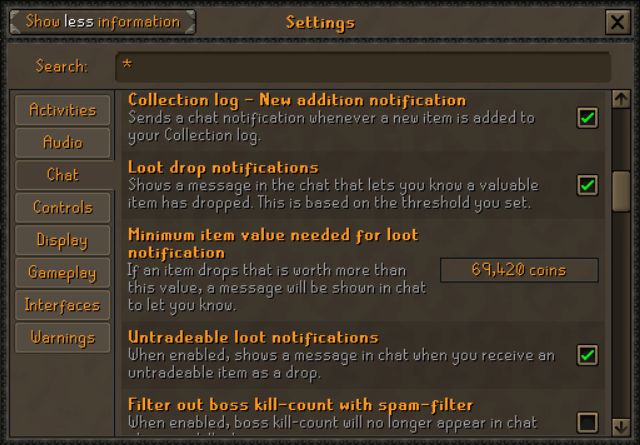

# Dink

This is a fork of Universal Discord Notifier. It doesn't strictly stick to the Discord webhook format, it has a bunch of
added a bunch of metadata that allows the webhook server to analyze messages or even generate its own.

## Other Setup

As the collection notification uses the chat message to determine when a collection log item has been added, these
messages need to be enable in game. You can find this option
in `Settings > All Settings > Chat > Collection log - New addition notification`



---

## Config Options

Most of the config options are self-explanatory. But the notification messages for each notification type also
contain some words that will be replaced with in-game values.

#### All messages:

`%USERNAME%` will be replaced with the username of the player.

JSON:

```json
{
  "content": "Text message as set by the user",
  "extra": {},
  "type": "NOTIFICATION_TYPE",
  "playerName": "your rsn",
  "embeds": []
}
```

The examples below omit `embeds` and `playerName` keys because they are always the same.

#### Collection:

`%ITEM%` will be replaced with the item that was dropped for the collection log.

JSON:

```json
{
  "content": "%USERNAME% has added %ITEM% to their collection",
  "extra": {
    "itemName": "%ITEM%"
  },
  "type": "COLLECTION"
}
```

#### Level:

`%SKILL%` will be replaced with the skill name and level that was achieved

JSON:

```json
{
  "content": "%USERNAME% has levelled %SKILL%",
  "extra": {
    "levelledSkills": {
      "//": "These are the skills that dinked",
      "Skill name": 30
    },
    "allSkills": {
      "//": "These are all the skills",
      "Skill name": 30,
      "Other skill": 1
    }
  },
  "type": "LEVEL"
}
```

#### Loot:

`%LOOT%` will be replaced with a list of the loot and value of said loot

`%SOURCE%` will be replace with the source that dropped or gave the loot

```json
{
  "content": "%USERNAME% has looted: \n\n%LOOT%\nFrom: %SOURCE%",
  "extra": {
    "items": [
      {
        "//type": "SerializedItemStack",

        "id": 1234,
        "quantity": 1,
        "priceEach": 42069,
        "//priceEach": "GE price of the item",
        "name": "Some item"
      }
    ],
    "source": "Giant rat"
  },
  "type": "LOOT"
}
```

#### Slayer:

`%TASK%` will be replaced with the task that you have completed. E.g. `50 monkeys`

`%TASKCOUNT%` will be replaced with the number of tasks that you have completed.

`%POINTS%` will be replaced with the number of points you obtained from the task

```json
{
  "content": "%USERNAME% has completed a slayer task: %TASK%, getting %POINTS% points and making that %TASKCOUNT% tasks completed",
  "extra": {
    "slayerTask": "Slayer task name",
    "slayerCompleted": "30",
    "slayerPoints": "30"
  },
  "type": "SLAYER"
}
```

#### Quests:

`%QUEST%` will be replaced with the name of the quest completed

```json
{
  "content": "%USERNAME% has completed a quest: %QUEST%",
  "extra": {
    "questName": "Recipe for Disaster"
  },
  "type": "QUEST"
}
```

#### Clue Scrolls:

`%CLUE%` will be replaced with the type of clue (beginner, easy, etc...)

`%LOOT%` will be replaced with the loot that was obtained from the casket

`%COUNT%` will be replaced by the number of times that you have completed that tier of clue scrolls

```json
{
  "content": "%USERNAME% has completed a %CLUE% clue, they have completed %COUNT%.\nThey obtained:\n\n%LOOT%",
  "extra": {
    "clueType": "Beginner",
    "numberCompleted": 123,
    "items": [
      {
        "//type": "SerializedItemStack",

        "id": 1234,
        "quantity": 1,
        "priceEach": 42069,
        "//priceEach": "GE price of the item",
        "name": "Some item"
      }
    ]
  },
  "type": "CLUE"
}
```

## Credits

This plugin uses code from [Universal Discord Notifier](https://github.com/MidgetJake/UniversalDiscordNotifer).